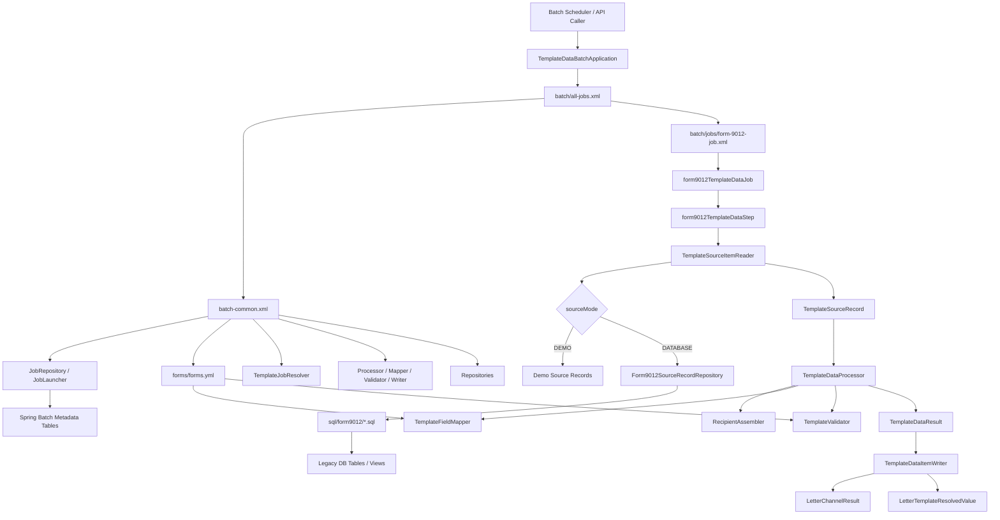

# GitHub Copilot Prompt: Rebuild Template Data Spring Batch Framework

## How To Use This Prompt In IntelliJ GitHub Copilot

1. Open IntelliJ IDEA.
2. Create or open an empty Maven Java project folder.
3. Open GitHub Copilot Chat.
4. Select Agent mode if available.
5. Paste this entire prompt.
6. Tell Copilot:

```text
Build this project from scratch. Create all files. Run mvn test. Fix errors until green. Do not redesign unless explicitly asked.
```

7. Review file changes before accepting.
8. If Copilot stops midway, say:

```text
Continue from the last unfinished milestone. Do not redesign. Follow the architecture exactly.
```

9. If IntelliJ only has Ask/Chat and not Agent mode, paste one milestone at a time and ask Copilot to implement that milestone.

References:

- GitHub Copilot IDE chat: https://docs.github.com/copilot/using-github-copilot/asking-github-copilot-questions-in-your-ide
- GitHub Copilot features: https://docs.github.com/en/copilot/get-started/features

---

# Objective

Build a Spring Boot + Spring Batch framework to migrate large stored procedures used for letter template data generation.

The system must migrate stored procedure logic into traceable, testable Java batch processing without creating one huge Java class per stored procedure.

This framework is for template data/value assembly only. It does not generate PDF or letter documents.

Day one execution is batch. Future execution may be API/web-driven. Future data input may be JSON/API instead of database.

---

# Core Requirements

Use:

- Java 21
- Spring Boot
- Spring Batch
- Maven
- XML-based Spring Batch job configuration
- YAML form metadata
- External SQL resource files
- JDBC repositories
- Audit logging
- Final output table
- Resolved value audit table

Do not use annotations for batch jobs, steps, readers, processors, writers, or repositories.

Allowed annotations:

- `@SpringBootApplication`
- `@ImportResource`
- REST controller annotations only if web API is included

---

# Required Package Structure

Create:

```text
src/main/java/com/example/templatedata/
  api/
  batch/
  batch/listener/
  batch/processor/
  batch/reader/
  batch/writer/
  config/
  model/
  repository/
  service/
```

Create:

```text
src/main/resources/
  application.yml
  schema.sql
  batch/
    all-jobs.xml
    batch-common.xml
    jobs/
      form-9012-job.xml
  forms/
    forms.yml
  sql/
    form9012/
      resolve-business-date.sql
      resolve-event-date-window.sql
      find-source-records.sql
```

---

# Current Architecture



---

# Application Entry

Create `TemplateDataBatchApplication`.

It must import only:

```java
@ImportResource("classpath:batch/all-jobs.xml")
```

Do not import one form job directly from the application class.

Correct:

```java
@ImportResource("classpath:batch/all-jobs.xml")
```

Wrong:

```java
@ImportResource("classpath:batch/jobs/form-9012-job.xml")
```

Reason:

The same application must run 56+ form jobs.

---

# XML Job Registry

Create:

```text
src/main/resources/batch/all-jobs.xml
```

It must import all form jobs.

For now import:

```xml
<import resource="classpath:batch/jobs/form-9012-job.xml"/>
```

Also define:

```xml
<bean id="templateJobResolver"
      class="com.example.templatedata.batch.TemplateJobResolver"/>
```

The resolver maps:

```text
FORM_9012 -> form9012TemplateDataJob
FORM_8722 -> form8722TemplateDataJob
```

---

# Common XML

Create:

```text
src/main/resources/batch/batch-common.xml
```

Define shared beans:

- `templateJobRepository`
- `jobLauncher`
- `formDefinitionCatalog`
- `recipientAssembler`
- `templateFieldMapper`
- `templateValidator`
- `sqlResourceLoader`
- `form9012SourceRecordRepository`
- `letterChannelResultRepository`
- `templateDataProcessor`
- `templateDataItemWriter`
- `templateJobExecutionListener`
- `templateStepExecutionListener`

Keep common infrastructure here so 56 jobs can reuse it.

---

# FORM_9012 Job XML

Create:

```text
src/main/resources/batch/jobs/form-9012-job.xml
```

It must:

- import `batch-common.xml`
- define job id `form9012TemplateDataJob`
- define step id `form9012TemplateDataStep`
- use chunk processing
- reader: `form9012SourceItemReader`
- processor: `templateDataProcessor`
- writer: `templateDataItemWriter`
- commit interval: `100`
- register writer as step listener so it can access `StepExecution`

Reader must be step-scoped and accept job parameters:

- `templateCode`
- `sourceMode`
- `runDate`

Reader must also receive:

- `form9012SourceRecordRepository`

---

# Form Metadata

Create:

```text
src/main/resources/forms/forms.yml
```

Include:

```yaml
forms:
  FORM_9012:
    formNumber: "9012"
    defaults:
      create_pdf: 1
      paper_size:
      lob_cd: RL
      mail_type: R
      first_class: 1
      certified: 0
      send_to: B
      is_pending: 0
      pending_group:
      days_in_pending: 0
      num_sides: 1
    requiredFields:
      - acct_nmbr
      - buyr_full_name
      - buyr_addr_line_1
      - buyr_city_name
      - buyr_state_cd
      - buyr_postl_cd
      - buyr_csz
    rules:
      eventProcessCode: "48,000"
      allowedEventReasonCodes:
        - "89,010"
        - "89,020"
        - "89,030"
        - "89,040"
        - "89,050"
        - "89,060"
        - "89,070"
        - "89,080"
        - "89,090"
```

---

# Database Tables

Create `schema.sql`.

## LetterChannelResult

This is the final output table for vendor export or downstream processing.

Columns:

- `id`
- `job_execution_id`
- `step_execution_id`
- `template_code`
- `form_number`
- `account_number`
- `recipient_sequence`
- `is_cobuyer`
- `run_date`
- `source_mode`
- `status`
- `vendor_export_status`
- `output_payload`
- `output_payload_hash`
- `legacy_procedure`
- `legacy_section`
- `created_at`
- `updated_at`

## LetterTemplateResolvedValue

This is field-level audit.

Columns:

- `id`
- `letter_channel_result_id`
- `job_execution_id`
- `step_execution_id`
- `template_code`
- `form_number`
- `account_number`
- `recipient_sequence`
- `is_cobuyer`
- `field_name`
- `field_value`
- `field_type`
- `legacy_source`
- `legacy_procedure`
- `legacy_section`
- `resolved_at`

Add indexes for lookup by:

- `template_code`
- `account_number`
- `job_execution_id`
- `field_name`

---

# SQL Externalization Rule

Do not bury SQL inside Java strings.

All FORM_9012 SQL must live in:

```text
src/main/resources/sql/form9012/
```

Create:

1. `resolve-business-date.sql`
2. `resolve-event-date-window.sql`
3. `find-source-records.sql`

The Java repository may load SQL resources and execute them, but must not contain large SQL blocks.

---

# FORM_9012 SQL Responsibilities

The external SQL must represent logic from stored procedure:

```text
forms_db.alc_form9012_hist
```

Implement SQL files for:

## Date Window

- `pBUSDT`: prior business day from `forms_views.form_calendar`
- `pMINDT`: min calendar date for business date
- `pMAXDT`: max calendar date for business date

## Source Records

Fetch from:

- `SPOT_BVAL.faw_event`
- `forms_db.faw_reas_descform9012`
- `forms_views.pfolio_acct_hist`
- `forms_views.acct_cust_nppi` as buyer
- `forms_views.acct_cust_nppi` as co-buyer
- `forms_views.pfolio_acct_vhcl_hist`
- `forms_views.orh`
- `SPOT_BVAL.faw_reas`
- `forms_views.daily_forms`

Apply filters:

- event process code = `48,000`
- event reason code in configured FORM_9012 list
- event last updated between min and max date
- active account only
- lob = `RL`
- buyer relationship type = `1`
- ORH zone between `200` and `323`
- ORH zone not `318`
- no recent daily form where form number = `9012`, status = `P`, WolverineStatus = `S`
- latest event per account

---

# Java Model Classes

Create:

- `AddressFacts`
- `PartyFacts`
- `RecipientFacts`
- `TemplateSourceRecord`
- `TemplateDataResult`
- `Form9012DateWindow`
- `FormDefinition`

`TemplateSourceRecord` must contain:

- `templateCode`
- `runDate`
- `businessDate`
- `accountNumber`
- `buyer`
- `cobuyer`
- `eventProcessCode`
- `eventReasonCode`
- `reasonDescription`
- `formDescription`
- `vin`
- `areaNumber`
- `regionNumber`
- `zoneNumber`
- `duplicatePriorForm`

---

# Repositories

## SqlResourceLoader

Create a simple class that loads SQL files from classpath.

## Form9012SourceRecordRepository

Responsibilities:

- load SQL using `SqlResourceLoader`
- execute date-window SQL
- execute source-record SQL
- map DB rows into `TemplateSourceRecord`
- provide `demoSourceRecords()` for local H2 testing

Support source modes:

- `DATABASE`: run external SQL
- `DEMO`: return local demo source record

## LetterChannelResultRepository

Responsibilities:

- insert final output rows into `LetterChannelResult`
- serialize output payload as JSON
- generate SHA-256 payload hash
- insert every resolved field into `LetterTemplateResolvedValue`
- store legacy procedure and legacy section
- store job execution id and step execution id

---

# Services

## RecipientAssembler

Move buyer/co-buyer split logic here.

It must:

- always add buyer row with `is_cobuyer = 0`
- add co-buyer row with `is_cobuyer = 1` only when co-buyer exists and address differs
- calculate `cobuyer_has_buyer_address`
- log co-buyer present
- log same address result
- log line1/line2/city/state match
- log add/skip co-buyer row reason

Add method-level comment mapping to stored procedure section:

```text
form9012.assembleCandidates
```

## AddressFormatter

Implement:

- line1 + optional line2
- uppercase state
- ZIP+4 formatting
- city/state/ZIP
- same-address comparison

Add comments mapping each helper to stored procedure expressions.

## TemplateFieldMapper

Map final output fields:

- `run_date`
- `bus_date`
- `acct_nmbr`
- `buyr_full_name`
- `buyr_addr_line_1`
- `buyr_city_name`
- `buyr_state_cd`
- `buyr_postl_cd`
- `buyr_csz`
- `cobuyr_full_name`
- `cobuyr_addr_line_1`
- `cobuyr_city_name`
- `cobuyr_state_cd`
- `cobuyr_postl_cd`
- `cobuyr_csz`
- `cobuyer_has_buyer_address`
- `event_proc_cd`
- `event_reas_cd`
- `reas_desc`
- `form_desc`
- `form_number`
- `barcode`
- `vin`
- `loctn_cd`
- defaults from `forms.yml`

Log every field:

```text
PROC-CONVERSION-FIELD legacyProcedure=... legacySection=... field=... legacySource=... value=...
```

## TemplateValidator

Validate required fields from `forms.yml`.

Log:

- validation start
- field passed
- field failed
- validation end

---

# Batch Classes

## TemplateSourceItemReader

Responsibilities:

- accept `templateCode`, `sourceMode`, `runDate`
- call repository
- return `TemplateSourceRecord`
- log reader init/read/end

## TemplateDataProcessor

Responsibilities:

- load `FormDefinition`
- filter duplicate prior form
- call `RecipientAssembler`
- call `TemplateFieldMapper`
- call `TemplateValidator`
- return `TemplateDataResult`

Must log:

- process start
- each stage
- process end

## TemplateDataItemWriter

Responsibilities:

- implement `ItemWriter<TemplateDataResult>`
- implement `StepExecutionListener`
- call `LetterChannelResultRepository`
- log final output snapshot

---

# API Package

Create API package for future web use.

Classes:

- `TemplateJobController`
- `TemplateJobRequest`
- `TemplateJobLaunchResponse`

Controller endpoints:

- `POST /template-data/jobs`
  - launches job by `templateCode`
  - uses `TemplateJobResolver`
- `GET /template-data/jobs/{executionId}`
  - returns status, start/end time, exit status, parameters, step counts

Do not inject one hardcoded `Job`.

---

# Logging Standard

Use structured log prefixes:

- `BATCH-JOB-START`
- `BATCH-JOB-END`
- `BATCH-STEP-START`
- `BATCH-STEP-END`
- `FORM-METADATA-LOADED`
- `FORM-METADATA-LOOKUP`
- `PROC-CONVERSION-READER-INIT`
- `PROC-CONVERSION-READER-READ`
- `PROC-CONVERSION-PROCESS-START`
- `PROC-CONVERSION-CHECK`
- `PROC-CONVERSION-FIELD`
- `PROC-CONVERSION-DEFAULT`
- `PROC-CONVERSION-VALIDATION-PASSED`
- `PROC-CONVERSION-VALIDATION-FAILED`
- `PROC-CONVERSION-WRITER-ROW`

Every conversion log should include:

- `legacyProcedure`
- `legacySection`
- `templateCode`
- `accountNumber` where available
- `isCobuyer` where available

---

# Milestones

## Milestone 1: Project Skeleton

Create Maven Spring Boot project with Spring Batch, JDBC, Web, Validation, H2, Test.

Acceptance:

- `mvn test` runs
- app context loads

## Milestone 2: XML Batch Infrastructure

Create:

- `batch/all-jobs.xml`
- `batch/batch-common.xml`
- `batch/jobs/form-9012-job.xml`

Acceptance:

- job bean is `form9012TemplateDataJob`
- app imports only `all-jobs.xml`

## Milestone 3: Metadata

Create `forms.yml` and YAML loader.

Acceptance:

- FORM_9012 metadata loads
- defaults and required fields are available to mapper/validator

## Milestone 4: External SQL

Create SQL files under `sql/form9012`.

Acceptance:

- no large SQL blocks in Java
- repository loads SQL resources

## Milestone 5: FORM_9012 Source Reader

Create repository and reader.

Acceptance:

- `sourceMode=DEMO` works locally
- `sourceMode=DATABASE` path exists for real environment

## Milestone 6: Conversion Logic

Implement:

- buyer/co-buyer assembly
- address formatting
- field mapping
- required validation

Acceptance:

- output contains complete FORM_9012 field shape

## Milestone 7: Output And Audit Tables

Implement:

- `LetterChannelResult`
- `LetterTemplateResolvedValue`

Acceptance:

- buyer and co-buyer output rows are written
- all resolved values are written

## Milestone 8: API Entry

Implement API job launch/status.

Acceptance:

- controller resolves job by `templateCode`
- no single hardcoded job injection

## Milestone 9: Tests

Create integration test:

- launch FORM_9012 job with `sourceMode=DEMO`
- assert job completed
- assert read count = 1
- assert write count = 1
- assert `LetterChannelResult` row count = 2
- assert `LetterTemplateResolvedValue` row count = 72

## Milestone 10: Documentation

Create:

```text
docs/FORM_9012_MILESTONE_COMPLETION.md
```

Document:

- current architecture
- completed work
- database dependency boundary
- remaining higher-environment validation
- how to add another form

---

# Generate New Jobs For New Procedures

This framework must support generating new jobs for new stored procedures/forms.

For each new procedure/form, follow this repeatable recipe.

## Step 1: Add Metadata

Add to:

```text
src/main/resources/forms/forms.yml
```

Example:

```yaml
forms:
  FORM_8722:
    formNumber: "8722"
    defaults:
      create_pdf: 1
      lob_cd: RL
      mail_type: R
      send_to: B
    requiredFields:
      - acct_nmbr
      - buyr_full_name
      - buyr_addr_line_1
    rules:
      eventProcessCode: "48,000"
```

## Step 2: Add SQL Folder

Create:

```text
src/main/resources/sql/form8722/
  resolve-business-date.sql
  resolve-event-date-window.sql
  find-source-records.sql
```

If the new procedure uses the same date-window logic, reuse the same SQL content pattern.

## Step 3: Add Job XML

Create:

```text
src/main/resources/batch/jobs/form-8722-job.xml
```

Use job id:

```text
form8722TemplateDataJob
```

Use step id:

```text
form8722TemplateDataStep
```

## Step 4: Import Job XML

Update:

```text
src/main/resources/batch/all-jobs.xml
```

Add:

```xml
<import resource="classpath:batch/jobs/form-8722-job.xml"/>
```

## Step 5: Add Or Reuse Repository

If SQL shape is similar, create a generic source repository.

If the procedure has different joins/fields, create:

```text
Form8722SourceRecordRepository
```

Do not place SQL in Java. Load SQL from resources.

## Step 6: Reuse Common Components

Reuse:

- `TemplateDataProcessor`
- `RecipientAssembler`
- `AddressFormatter`
- `TemplateFieldMapper`
- `TemplateValidator`
- `TemplateDataItemWriter`
- `LetterChannelResult`
- `LetterTemplateResolvedValue`

Only add form-specific code when the procedure has unique logic.

## Step 7: Add Test

Create a test that:

- launches `FORM_8722`
- uses `sourceMode=DEMO`
- verifies job completed
- verifies output rows
- verifies audit rows

## New Job Prompt For Copilot

Use this smaller prompt when adding one new procedure:

```text
Add a new Spring Batch XML job for FORM_XXXX using the existing template-data framework.

Do not redesign the architecture.
Do not put SQL inside Java.
Do not create a huge Java class.

Use:
- batch/jobs/form-XXXX-job.xml
- job id formXXXXTemplateDataJob
- step id formXXXXTemplateDataStep
- sql/formXXXX/*.sql
- forms.yml metadata
- source repository only if needed
- existing processor, mapper, validator, writer, output tables, and audit tables

Add DEMO source mode for local tests.
Add integration test that launches FORM_XXXX and verifies output/audit rows.
Run mvn test and fix errors.
```

---

# Future Architecture

Today:

```text
DATABASE or DEMO source
-> reader
-> processor
-> writer
-> output/audit tables
```

Future:

```text
JSON/API input
-> same reader contract or alternate reader
-> same processor
-> same mapper
-> same validator
-> same writer
-> same audit/output tables
```

When DB is retired:

- remove SQL files
- replace `Form9012SourceRecordRepository.findSourceRecords`
- keep source model stable
- keep mapper/validator/writer unchanged
- keep `LetterChannelResult`
- keep `LetterTemplateResolvedValue`

---

# Important Constraints

- Do not translate stored procedure line by line into one Java class.
- Do not bury SQL in Java.
- Do not hardcode one form job in the application.
- Keep job definitions XML-based.
- Keep form metadata YAML-based.
- Keep SQL externalized.
- Keep business logic out of controller.
- Keep database dependency isolated.
- Keep every conversion method commented with stored procedure mapping.
- Add logs for every converted decision and field.
- Make it easy to add 56 forms.

---

# Final Command

After generating the project, run:

```bash
mvn test
```

Fix all compile/test failures until green.
